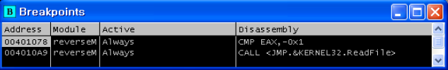
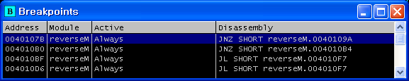

# Lena's Reversing for Newbies #01

#### 1. 문제

- 문제: OllyDbg+Assembler+Patching a basic reverseme
- [파일다운로드](https://tuts4you.com/download/122/)

#### 2. 파일 실행

##### 1) reverseMe.exe 실행

- "Evaluation period out of date. Purchase new license" 메시지박스 출력

#### 3.  OllyDbg로 어셈블리코드 분석

##### 1) 메시지박스 문자열 검색

##### 2) 메시지박스 출력 전 후 어셈블리코드 분석

- 1)의 문자열을 마우스 더블클릭하여 CPU창으로 이동 

  - 메시지박스 출력 후 프로그램 종료(MessageBoxA() -> ExitProcess() 함수 호출)
    - 메시지박스 출력 문자열: "Evaluation period out of date. Purchase new license"

- 메시지박스 출력 전 CreateFileA() 함수 호출

  - CreateFileA() 함수 호출 부분에 브레이크포인트 설정(F2) 후 OllyDbg 재실행(Ctrl+F2, F9)

  

  - 참고: CreateFileA(): 파일이나 I/O 디바이스를 생성하거나 여는 함수
    - [CreateFile함수 msdn 설명](https://docs.microsoft.com/en-us/windows/desktop/api/fileapi/nf-fileapi-createfilea)
    - 주요 파라미터
      - FileName: Keyfile.dat
      - Mode: OPEN_EXISTING(파일이 있는 경우 열기)
    - 리턴값
      - 성공: 파일, 디바이스, 명명된 파이프, 메일 슬롯의 핸들 값을 리턴
      - 실패: INVALID_HANDLE_VALUE(-1(decimal), FFFFFFFF(hex) )

- CreateFileA() 함수 호출 후 리턴값은 EAX 레지스터 값이며, reverseMe.exe 경로에 "Keyfile.dat"파일이 없기때문에 FFFFFFFF 리턴

- CMP EAX,-0x1: 리턴값인 EAX 레지스터 값이  -0x1인지 비교
  - EAX가 -1이므로 CMP 결과는 0이 됨 -> Z 플래그가 1로 설정된 것을 알 수 있음
- JNZ SHORT reverseM.0040109A
  - CMP 결과 0(Zero)이므로 분기하지 않고 다음 코드 실행
  - JNZ(Jump Not Zero): 0이 아니면 분기
- MessageBoxA() 호출: 메시지박스 출력
- ExitProcess(): 프로그램 종료

##### 3) Z 플래그를 임의 설정 하여 reverseM.0040109A로 분기(메시지박스 출력 안되도록) 

- JNZ SHORT reverseM.0040109A에 브레이크 포인트 설정
- Z 플래그를 1에서 0으로 변경(마우스 더블클릭하면 변경됨)
- reverseM.0040109A로 분기

##### 4) reverseM.0040109A로 분기 후 어셈블리코드 분석 

- ReadFile() 함수 호출 부분에 브레이크포인트 설정 후 브레이크포인트까지 코드 실행
  - [ReadFile() 함수 msdn설명](https://docs.microsoft.com/en-us/windows/desktop/api/fileapi/nf-fileapi-readfile)
  - 참고: ReadFile()  함수: 특정 파일이나 I/O 디바이스로 부터 데이터를 읽는 함수
    - 주요 파라미터
      - nNumberOfBytesToRead: 읽어야 될 최대 바이트 
    - 리턴값
      - 성공: 0이 아닌 값(TRUE)
      - 실패: 0(FALSE)
- ReadFile() 함수 호출 후 리턴값은 EAX 레지스터 값이며 실패를 나타내는 0값을 리턴
  - Z플래그가 1로 설정됨

- TEST EAX, EAX: 두 오퍼렌드를 AND 연산함
  - EAX가 0이므로 AND 연산 결과도 0
- JNZ SHORT reverseM.004010B4
  - Jump Not Zero인 경우에만 reverseM.004010B4로 분기하므로 실행되지 않음
- JMP SHORT reverseM.004010F7
  - reverseM.004010F7로 분기

##### 5) reverseM.004010F7로 분기 

- reverseM.004010F7로 분기

- 분기 후 메시지박스 출력 후 프로그램 종료(MessageBoxA() -> ExitProcess())

  - 메시지박스 내용: "Keyfile is not valid. Sorry."
  - 메시지박스 내용으로 보아 리버싱에 실패했음을 알 수 있음

##### 6)  디버거를 다시 시작하여 ReadFile 함수 호출 어셈블리코드까지 실행

- 브레이크포인트 설정

- 첫 번째 브레이크 포인트까지 코드 진행 후 3)번과 같이 Z플래그 임의 설정하여 reverseM.0040109A로 분기
- ReadFile()함수 호출 후 리턴값을  테스트하는 코드  실행, reverseM.00401B0 전 코드까지 진행

- reverseM.00401B0 코드 실행 전 Z 플래그를 임의 설정하여 reverseM.00401B4로 분기
  - JNZ SHORT reverseM.004010B4: Not Zero이면 reverseM.004010B4으로 분기

##### 7) reverseM.004010B4으로 분기 

- reverseM.004010B4로 분기하여 코드를 어셈블리코드를 따라 실행
- CMP DWORD PTR DS:[0x402173],0x10
  - DS:[0x402173]값을 0x10(16(dec))과 비교
  - CMP 연산: 앞 오퍼랜드 - 뒤 오퍼랜드
- JL SHORT reverseM.004010F7
  - CMP의 두 오퍼랜드 중 앞 오퍼랜드가 0x10보다 작으면 reverseM.004010F7로 분기
  - JL: Jump if Less
  - reverseM.004010F7로 분기하게 되면 5)번의 "Keyfile is not valid. Sorry" 메시지박스가 출력
- JL SHORT reverseM.004010F7 코드 실행 전 까지 진행
  - S 플래그가 1로 설정됨
    - S 플래그: 연산결과 음수일때 1이 설정됨

##### 8) S 플래그를 0으로 임의설정하여 reverseM.004010F7로 분기하지 않고 다음 어셈블리코드 진행

- MOV AL,BYTE PTR DS:[EBX+0x40211A] 코드를 실행할 차례이나 코드 진행 화살표를 보면 화살표가 자기 자신을 가르킴
  - 반복 문인 것을 알 수 있음

- 코드 실행 범위 아래 어셈블리 코드에 브레이크포인트를 설정 하고 브레이크 포인트까지 코드 진행

- CMP ESI,0x8: ESI 레지스터와 0x8과 비교

- JL SHORT reverseM.004010F7

  - ESI레지스터가 0x8보다 작으면 reverseM.004010F7로 분기
  - reverseM.004010F7로 분기하게 되면 5)번의 "Keyfile is not valid. Sorry" 메시지 박스가 출력

- JL SHORT reverseM.004010F7 코드 실행 전 까지 진행

  - S 플래그가 1로 설정됨
    - S 플래그: 연산결과 음수일때 1이 설정됨
  - ESI 레지스터 값은 0
    - ESI 레지스터:데이터를 조작하거나 복사할 때 데이터의 주소가 저장(Source Index)
    - 이전 코드들에서 ESI 레지스터에 영향을 주는 코드
      - 004010B6    .  33F6                     XOR ESI,ESI: 초기화(XOR은 값이 같으면 0, 다르면 1)
      - 004010CF    .  46                       INC ESI: ESI값 1증가

  

##### 9) S 플래그를 0으로 임의설정하여 reverseM.004010F7로 분기하지 않고 reverseM.00401205로 분기

- JMP reverseM.00401205: reverseM.00401205로 분기

- 분기 후 메시지박스 출력 후 프로그램 종료(MessageBoxA() -> ExitProcess())
  - 메시지박스 출력 문자열: "You really did it! Congrats !!!"
  - 메시지박스 내용으로 보아 리버싱에 성공했음을 알 수 있음

#### 4. 3.9)의 메시지박스가 출력되도록 어셈블리 코드를 패치

- 플래그를 임의 설정하지 않고 원하는 결과가 나오도록 코드를 패치 하기 위해 OllyDbg 다시 시작
- 위의 분석 과정을 통해 브레이크포인트 설정되어 있음

