# Lena's Reversing for Newbies #02

### 1. 문제

- 문제: Keyfiling the reverseme + assembler 
- [파일다운로드](https://tuts4you.com/download/123/)

### 2. 파일실행

- \#01과 동일 파일

- reverseMe.exe를 실행하면 "Evaluation period out of date. Purchase new license" 메시지박스 출력

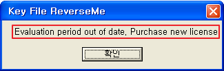

-  \#01과 다르게 \#02에서는 keyfile을 만들어서 "You really did it! Congrats !!!" 메시지박스가 출력되도록 해야함

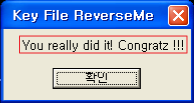

### 3. OllyDbg로 어셈블리코드 분석

- 상세 분석은 \#01에서 했으므로 생략

#### 1) Keyfile 생성, CreateFileA 함수를 호출하여 파일 열기

- "Evaluation period out of date. Purchase new license" 메시지박스 출력 전 CreateFileA 함수를 호출
  - FileName: "Keyfile.dat"
  - Mode: OPEN_EXISTING

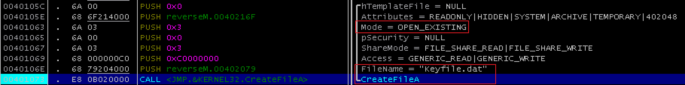

- reverseMe.exe와 동일 경로에 "Keyfile.dat" 파일을 생성(내용은 없는 채로 생성)

   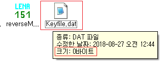

- CreateFileA 함수 호출 코드에 브레이크 포인트 설정한 후  한 후 CreateFileA 함수 호출까지 실행 
- CreateFileA 함수 호출 후 리턴값인 EAX 레지스터 값은 -0x1이 아닌 값이므로 성공
  - EAX 레지스터 값: 0x00000044
  - 리턴값을 비교하는 코드와 비교 결과에 따라 분기하는 코드에 따라 reverseM.0040109A로 분기

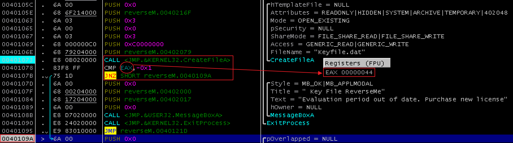

#### 2)  reverseM.0040109A로 분기, ReadFile 함수를 호출하여 파일 내용 읽기

- ReadFile 함수 호출 코드에 브레이크 포인트 설정한 후  한 후 ReadFile 함수 호출까지 실행
- ReadFile 함수 호출 후 리턴값인 EAX 레지스터 값은 0이 아닌 값이므로 함수 호출 성공
  - EAX 레지스터 값: 0x00000001
  - 리턴값을 비교하는 코드와 비교 결과에 따라 분기하는 코드에 따라 reverseM.004010B4로 분기

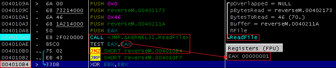

#### 3) reverseM.004010B4로 분기하여 코드 실행

- reverseM.004010B4로 분기하여 어셈블리 코드를 차례대로 실행
- EBX, ESI 레지스터를 0으로 초기화(XOR연산: 비트값이 같으면 0, 다르면 1)
  - XOR EBX,EBX
  - XOR ESI,ESI
- CMP DWORD PTR DS:[0x402173],0x10
  - DS:[0x402173]가 가리키는 값과 0x10(16(dec))와 비교
-  JL SHORT reverseM.004010F7
  - CMP의 두 오퍼랜드 중 앞 오퍼랜드가 0x10보다 작으면 reverseM.004010F7로 분기
  - JL: Jump if Less
- DS:[0x402173]: 0x00000000이므로 비교문 결과 reverseM.004010F7로 분기하게 됨
  -  "Keyfile is not valid. Sorry" 메시지박스가 출력(실패)

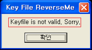

- DS:[0x402173]는 ReadFile  함수의 PByteRead가 가리키는 값임을 알 수 있음

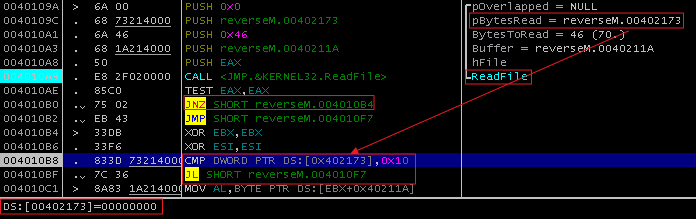

- ReadFile 함수의 pByteRead 파라미터의 의미

  - [ReadFile함수 msdn 설명](https://docs.microsoft.com/en-us/windows/desktop/api/fileapi/nf-fileapi-readfile)
  - pByteRead는 lpNumberOfBytesRead 파라미터에 해당
    - 읽어드린 byte 수

- 1) 에서 생성한 Keyfile.dat은 내용이 없는 빈 파일

  - ReadFile함수를 실행 할 때 pByteRead가 가리키는 값은 0이 됨

- Keyfile.dat파일 내용 길이(byte)를 유추

  - 힌트: CMP DWORD PTR DS:[0x402173],0x10, JL SHORT reverseM.004010F7
  - 최소 16 byte 이상
    -  JL로 되어 있기 때문
  - 최대 70byte 이하
    - ReadFile 함수의 BytesToRead(46(hex, 70(dec))

#### 4) Keyfile.dat에 16byte 이상 내용을 입력 한 후 어셈블리 코드 다시 분석

- Keyfile.dat을 열어 16byte 입력 후 저장

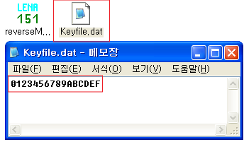

- 004010B8   CMP DWORD PTR DS:[0x402173],0x10부분에 브레이크 포인트를 설정
- OllyDbg를 재시작하여 브레이크 포인트까지 코드 실행
- reverseM.004010F7로 분기하지 않음

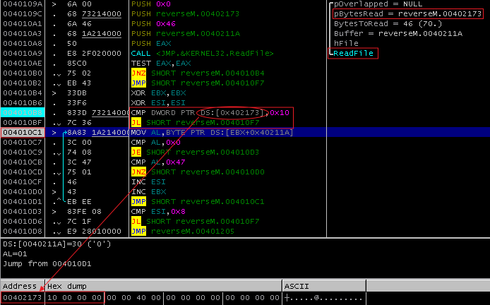

#### 5) 반복문 어셈블리 코드 실행

- reverseM.004010F7로 분기하지 않고 코드를 차례대로 실행하면 반복문 어셈블리 코드가 나옴
  - 반복문: reverseM.004010C1 ~ reverseM.004010D1
- 반복문 실행이 끝나고 실행되는 reverseM.004010D3에 브레이크 포인트를 설정하고 브레이크 포인트까지 실행
- CMP ESI,0x8, JL SHORT reverseM.004010F7
  - ESI 레지스터 값을 0x8과 비교, 비교결과 ESI 레지스터 값이  0x8보다 작아 reverseM.004010F7로 분기 될 예정
    -   reverseM.004010F7로 분기 시 "Keyfile is not valid. Sorry" 메시지박스 출력(실패), 프로그램 종료
    -   ESI 레지스터 값은 0x8보다 커야함을 알수 있음
  - ESI, EBX 레지스터는 3) 에서 XOR연산으로 0x0으로 초기화 이후, 반복문 안에서  INC 연산을 통해 1씩 증가 하고 있음
    - 반복문이 종료된 후 ESI 레지스터 값은 0x0,  EBX 레지스터 값은 0x10

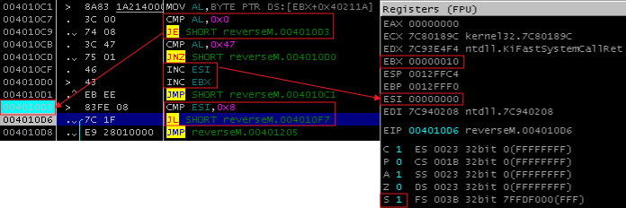

- JMP reverseM.00401205를 실행하여 reverseM.00401205로 분기되면 원하는 메시지박스가 출력됨
  - 메시지박스 내용: "You really did it! Congrats !!!"
- 반복문 내의 어셈블리 코드 분석이 필요
  - 반복문 내 비교문, 분기문의 의미 파악 필요
  - ESI 레지스터, EBX 레지스터를 증가하는 INC 연산 코드 실행이 언제되는지 분석 필요
- 반복문이 시작되는 reverseM.004010C1에 브레이크 포인트를 설정 한 후 OllyDbg 재시작 후 브레이크 포인트까지 실행

#### 6) 반복문 분석

- MOV AL,BYTE PTR DS:[EBX+0x40211A]는 AL(1byte) 레지스터에 DS:[EBX+0x40211A] 1byte를 저장
  - DS:[EBX+0x40211A]에서 0x40211A는 ReadFile 함수에서 Buffer를 의미함
    - ReadFile 함수에서 
  - 실제 Hex Dump에서 0x40211A에는 Keyfile.dat에 입력된 내용이 저장되어 있는 것을 알 수 있음
  - 반복문 안에서 EBX를 증가, 반복문이 실행 되면서 DS:[EBX+0x40211A]가 가리키는 1byte를 AL을 저장

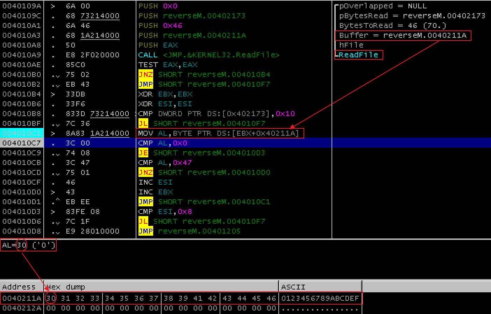

- CMP AL,0x0, JE SHORT reverseM.004010D3
  - CMP AL,0x0: 문자열의 끝, '\0'와 같은지 비교
  - JE SHORT reverseM.004010D3: 문자열의 끝이면  reverseM.004010D3로 분기(반복문 종료)
    - JE: Jump if Equal
- CMP AL,0x47,  JNZ SHORT reverseM.004010D0, INC ESI
  - CMP AL,0x47
    - AL 레지스터를 0x47('G')과 비교, 0x47는 character로 'G를 의미함'
  - JNZ SHORT reverseM.004010D0
    - 비교 결과 0x47('G')과 같지 않으면(Not Zero) reverseM.004010D0로 분기
  - INC ESI
    - 비교 결과 0x47('G')과 과 같으면(Zero) ESI 레지스터 값 0x1증가
    - 5)에서 분석했듯이 ESI가 0x8이상이어야함
    - "Keyfile.data"에는 'G'문자가 8byte이상 포함해야 함을 알 수 있음

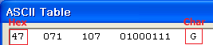

- reverseM.004010D0에는 INC EBX 코드가 있음
  - EBX는 ReadFile로 읽어온 문자열 버퍼의 index를 의미
  -  INC EBX: EBX 레지스터를 0x1 증가하는 것은 다음 문자를 가리키는 것을 의미
- JMP SHORT reverseM.004010C1: 반복문의 반복 실행

### 4. Keyfile.dat 수정

#### 1) Keyfile.dat가 만족해야 하는 조건

- Keyfile.dat이 파일 이름
- 파일 내용이 16byte 이상, 70byte 이하
- 파일 내용 중 8byte 이상이 'G'이어야 함

#### 2) Keyfile.dat 수정, 저장

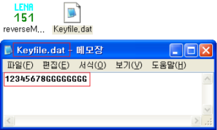

#### 3) reverseMe.exe 실행

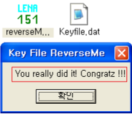

리버싱 끝 :)